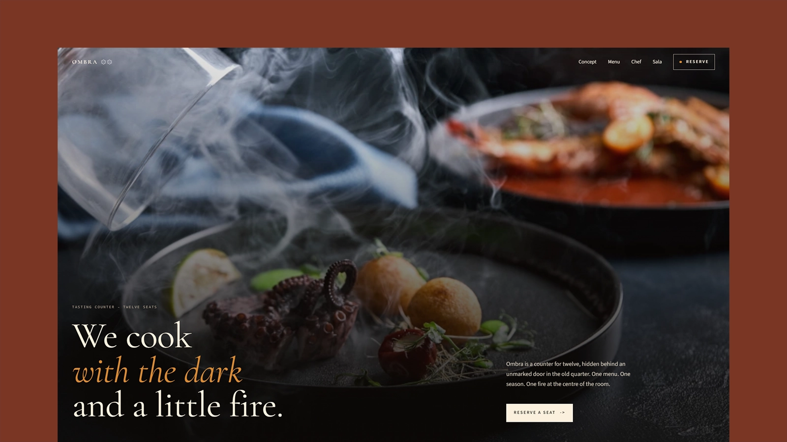

# Ombra - Astro Restaurant Theme

[](https://ombra-astro.vercel.app)


**Preview:** [https://ombra-astro.vercel.app](https://ombra-astro.vercel.app)

Ombra is a dark, editorial Astro theme for intimate restaurants, tasting counters, chefs, supper clubs, and hospitality concepts that need a fast one-page presence with strong imagery and polished SEO defaults.

## Features

- Static Astro pages with no client framework runtime.
- Typed site configuration in `src/config/site.ts`.
- Editable homepage content in `src/config/home.ts`.
- Reusable base layout, SEO head, navigation, and footer components.
- Canonical, Open Graph, Twitter card, and Restaurant JSON-LD metadata.
- Sitemap integration and generated production `robots.txt`.
- Local self-hosted fonts with only the weights used by the theme.
- Optimized local imagery with dimensions and accessible alt text.
- Semantic sections, skip link, visible focus styles, and labelled reservation form controls.
- Keyboard-accessible mobile navigation without extra JavaScript.
- Optional reveal animation controlled from site config.
- Responsive editorial layout with reduced-motion support.

## Use This Template

This repository is set up as a GitHub template. Click **Use this template** on GitHub, create your own repository, then clone your new project.

```bash
git clone https://github.com/your-username/your-ombra-site.git
cd your-ombra-site
npm install
npm run dev
```

The local site runs at the URL shown by Astro, usually `http://localhost:4321`.

## Customize

- Set the production URL in `astro.config.mjs` before deploying so canonical URLs, sitemap output, robots metadata, and social image URLs are correct.
- Edit site metadata, navigation, address, hours, social links, reservation settings, and animation settings in `src/config/site.ts`.
- Edit homepage copy, menu courses, chef timeline, interior notes, and footer text in `src/config/home.ts`.
- Replace section images in `src/assets`.
- Replace the social preview image in `public/og.png`.
- Adjust tokens, layout spacing, focus states, and responsive behavior in `src/styles.css`.

The default reservation form uses `mailto:` so the theme works without a backend. Replace `reservation.formAction` in `src/config/site.ts` with your booking provider, form endpoint, or server action for production use.

## Build

```bash
npm run check
npm run build
npm run preview
```

## Deployment

Ombra is static by default and can be deployed to Vercel, Netlify, Cloudflare Pages, GitHub Pages, or any static host. Update `site` in `astro.config.mjs` to your final domain before building.

## License

MIT License, copyright Andrei Alba.
